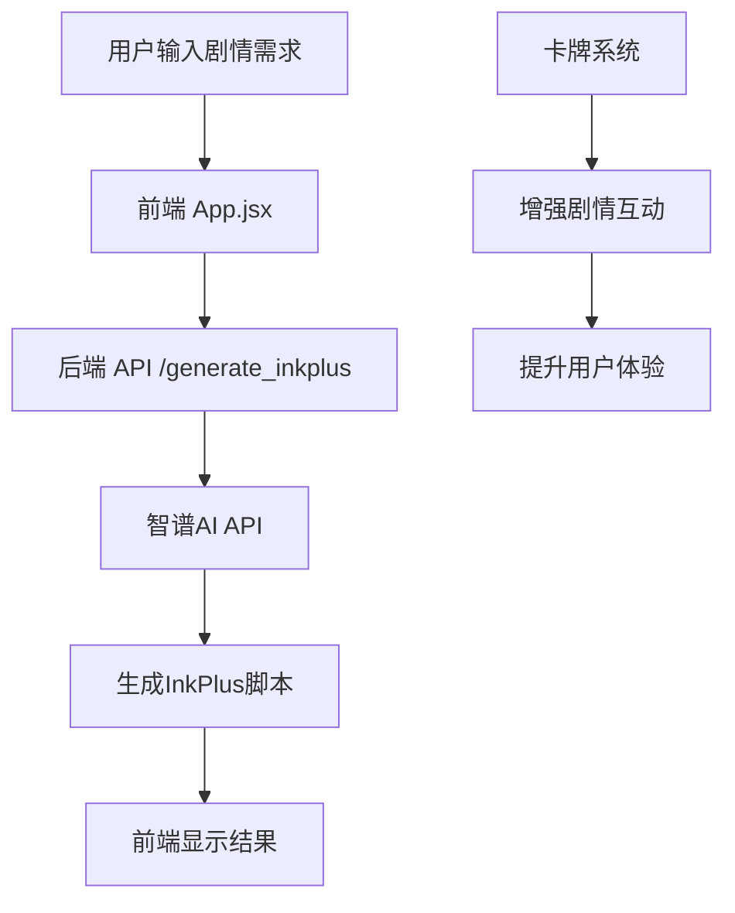

# 剧情生成器

一个基于AI的互动剧情生成工具，支持生成InkPlus格式的剧情脚本，并集成了轻量级卡牌系统来增强剧情互动体验。

## 🎯 项目特色

- **AI驱动**：使用智谱AI生成高质量的剧情内容
- **InkPlus支持**：完全兼容Ink语法，支持扩展功能
- **卡牌系统**：轻量级卡牌机制增强剧情互动
- **现代化界面**：简洁优雅的用户界面，遵循Apple OS设计美学
- **即时预览**：实时生成和预览剧情内容

## 🏗️ 项目架构

### 核心组件

```
剧情生成器/
├── backend/                 # 后端API服务
│   ├── api.py              # 🔥 核心API服务 (FastAPI)
│   ├── main_story_gen.py   # 批量剧情生成工具
│   └── requirements.txt    # Python依赖
├── frontend/               # 前端界面
│   ├── src/
│   │   ├── App.jsx        # 🔥 主要前端组件 (React)
│   │   ├── main.jsx       # 入口文件
│   │   └── style.css      # 样式文件
│   └── package.json       # Node.js依赖
├── card/                   # 🆕 卡牌系统
│   ├── card_system_design.json    # 卡牌系统设计方案
│   ├── card_database.json         # 卡牌数据库
│   └── card_game_engine.py        # 卡牌游戏引擎
├── example/                # 示例文件
├── doc/                    # 设计文档
└── ink/                    # Ink语法文档
```

### 当前工作流程



## 🚀 快速开始

### 1. 环境准备

#### 后端环境
```bash
cd backend
pip install -r requirements.txt
```

#### 前端环境
```bash
cd frontend
npm install
```

#### 环境变量配置
在 `backend/` 目录下创建 `.env` 文件：
```env
ZHIPU_API_KEY=your_zhipu_api_key_here
```

### 2. 启动服务

#### 启动后端API服务
```bash
cd backend
uvicorn api:app --reload --host 0.0.0.0 --port 8000
```

#### 启动前端开发服务器
```bash
cd frontend
npm run dev
```

### 3. 访问应用

- 前端界面：http://localhost:5173
- 后端API文档：http://localhost:8000/docs

## 💻 核心功能

### 1. InkPlus剧情生成

**API端点**：`POST /generate_inkplus`

**功能**：
- 基于自然语言描述生成InkPlus格式剧情脚本
- 支持多种AI模型选择
- 完全兼容Ink官方语法
- 支持InkPlus扩展功能（图片、音效、动画等）

**示例请求**：
```json
{
  "query": "一个关于魔法学院的冒险故事",
  "model": "GLM-4-FlashX-250414"
}
```

### 2. AI图片生成

**API端点**：`POST /generate_image`

**功能**：
- 根据文本描述生成剧情配图
- 使用智谱AI的CogView-4模型
- 支持多种图片风格和尺寸

### 3. 卡牌系统（实验性功能）

**设计理念**：
- **行动卡**：代表角色可以采取的行动
- **角色卡**：代表剧情中的重要角色
- **事件卡**：代表剧情中的突发事件
- **选择卡**：代表剧情分支点的关键选择

**核心特性**：
- 与剧情内容紧密结合
- 简单易懂的游戏规则
- 增强玩家的选择感和参与度

## 🎮 支持的剧情类型

- **奇幻冒险**：魔法、英雄、冒险
- **现代都市**：科技、都市生活、成长
- **历史传奇**：传统文化、智慧、荣誉
- **科幻未来**：科技、探索、未来世界

## 🔧 技术栈

### 后端
- **FastAPI**：现代化的Python Web框架
- **智谱AI**：强大的AI生成能力
- **Pydantic**：数据验证和序列化

### 前端
- **React**：现代化前端框架
- **Vite**：快速的构建工具
- **现代CSS**：简洁优雅的界面设计

### AI模型
- **GLM-4-FlashX-250414**：文本生成（默认）
- **CogView-4**：图片生成
- **GLM-Z1-Flash**：推理模型

## 📁 项目文件说明

### 核心文件
- `backend/api.py`：🔥 **主要后端API服务**
- `frontend/src/App.jsx`：🔥 **主要前端组件**
- `backend/main_story_gen.py`：批量剧情生成工具（备用）

### 卡牌系统
- `card/card_system_design.json`：卡牌系统设计方案
- `card/card_database.json`：完整的卡牌数据库
- `card/card_game_engine.py`：卡牌游戏逻辑引擎

### 文档和示例
- `doc/`：游戏设计方法论和角色塑造理论
- `example/`：InkPlus脚本示例
- `ink/`：Ink和InkPlus语法文档

## 🎨 设计理念

### 用户体验
- **简洁优雅**：遵循Apple OS设计美学原则
- **即时反馈**：实时生成和预览功能
- **直观操作**：无需学习复杂语法，直接用自然语言描述

### 技术设计
- **模块化**：清晰的前后端分离架构
- **可扩展**：支持新的AI模型和功能扩展
- **高性能**：异步处理和优化的API设计

## 🔮 未来规划

### 短期目标
- [ ] 完善卡牌系统与剧情的深度整合
- [ ] 增加更多剧情模板和预设
- [ ] 优化AI生成质量和稳定性

### 长期目标
- [ ] 支持多人协作创作
- [ ] 增加可视化剧情编辑器
- [ ] 导出多种格式（游戏引擎、电子书等）
- [ ] 社区分享和剧情市场

## 🤝 贡献指南

1. Fork 项目
2. 创建特性分支 (`git checkout -b feature/AmazingFeature`)
3. 提交更改 (`git commit -m 'Add some AmazingFeature'`)
4. 推送到分支 (`git push origin feature/AmazingFeature`)
5. 开启 Pull Request

## 📄 许可证

本项目采用 MIT 许可证 - 查看 [LICENSE](LICENSE) 文件了解详情

## 🙏 致谢

- [Ink](https://github.com/inkle/ink) - 优秀的互动小说引擎
- [智谱AI](https://open.bigmodel.cn/) - 强大的AI能力支持
- [FastAPI](https://fastapi.tiangolo.com/) - 现代化的API框架
- [React](https://reactjs.org/) - 强大的前端框架

---

**开始您的剧情创作之旅吧！** 🎭✨ 