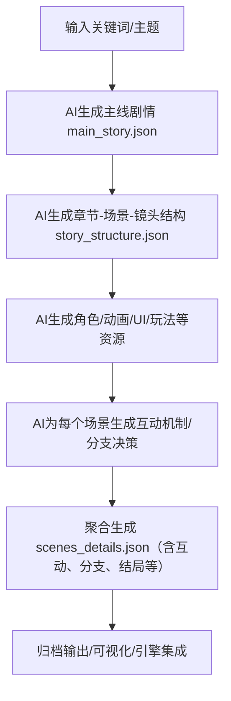
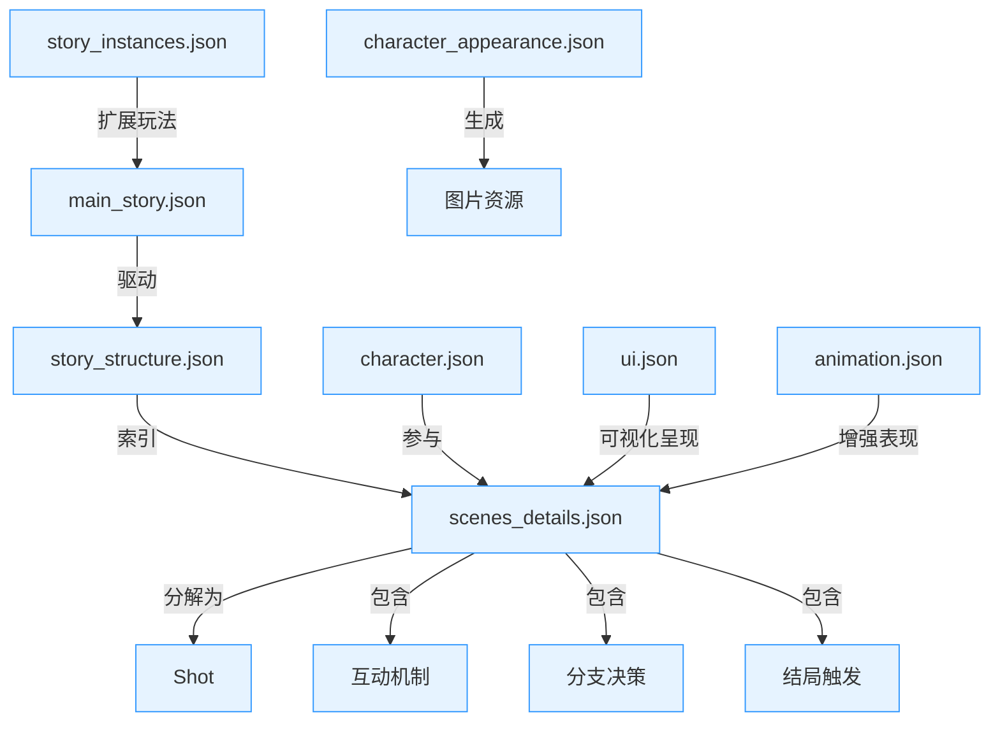

# 游戏剧情生成器

## 项目简介
本项目是一套基于AI自动化的叙事类游戏剧情生成工具，适用于以章节（chapter）、场景（scene）、镜头（shot）为结构的多类型游戏（如奇幻、科幻、悬疑、赛车等）。支持主线剧情、角色、动画、UI、玩法机制、互动分支等多维度内容的批量生成，自动归档，便于后续对接游戏引擎和编辑器。

## 核心特性
- 一键全量生成：只需输入关键词，自动推断类型，批量生成所有核心剧情结构与资源文件。
- 多维度AI生成：主线剧情、角色、场景、镜头、动画、UI、玩法机制、角色外观、互动机制、分支决策等均由AI自动生成。
- 互动与分支：每个场景自动生成与剧情背景紧密结合的互动机制（如卡牌、骰子、答题、战斗等）和用户决策分支，用户选择可影响剧情走向和结局。
- 结构化输出：所有内容自动合并进 scenes_details.json，便于可视化、编辑器开发和引擎驱动。
- 工程化与健壮性：自动归档、详细日志、异常兜底、debug文件辅助人工修复。

## 使用方法

1. 运行主脚本：
```bash
python main_story_gen.py <剧情关键词>
```
如：
```bash
python main_story_gen.py "极速重生"
```
2. 所有生成结果会自动保存在以时间戳命名的独立文件夹下，便于归档和版本管理。

## 主要输出文件说明
- `main_story.json`：主线剧情结构，包含summary、genre、world_setting、main_conflict、protagonist、antagonist、key_events、branches、endings、elements、interaction_mechanics等字段。
- `story_structure.json`：章节-场景-镜头的嵌套结构，便于层级化管理。
- `character.json`：主要角色设定，含性格、关系、特征等。
- `character_appearance.json`：角色外观描述与AI绘图prompt。
- `animation.json`：动画动作库，结构贴合Live2D/Spine/DragonBones等引擎。
- `ui.json`：UI组件结构与资源建议。
- `story_instances.json`：副本与玩法机制。
- `scenes_details.json`：每幕详细信息，**自动合并互动机制（interactions）、分支决策（branches）、结局触发等字段**，结构如下：

```json
{
  "scenes": [
    {
      "chapter_id": 1,
      "chapter_title": "...",
      "scene_id": 1,
      "scene_title": "...",
      "scene_desc": "...",
      "shots": [...],
      "characters": [...],
      "animations": [...],
      "ui": [...],
      "choices": [...],
      "interactions": [
        {"type": "卡牌", "desc": "...", "options": [{"choice": "A", "effect": "..."}], "background_relevance": "..."}
      ],
      "branches": [
        {"decision_point": "...", "choices": [{"option": "A", "next_scene": 2, "impact": "..."}]}
      ],
      "ending_trigger": {...}
    }, ...
  ]
}
```

## 系统架构设计理念

### 分层思想
- **数据层**：剧情结构、角色信息、主线/分支、互动机制、玩法机制等（如 main_story.json、story_structure.json、character.json、scenes_details.json、story_instances.json）
- **资源层**：图片、音频、动画等静态资源（如 png/ 目录下的图片、动画资源等）
- **表现层**：UI组件、动画表现、场景渲染（如 ui.json、animation.json）
- **逻辑层**：副本机制、剧情推进、分支选择、互动逻辑（如 story_instances.json、scenes_details.json 中的分支与条件）

### 推荐设计流程



## 数据结构关系图



## 资源命名与自动化建议
- 图片、音频等资源建议统一命名，便于自动化脚本批量检测和引用
- 建议开发自动检测脚本，校验 json 文件与资源目录的一一对应关系
- 资源路径建议采用相对路径，便于跨平台和版本管理

## 整体背景
- 游戏剧情通常按照"章-幕-镜头"结构展开：
  - **章**：故事的主要阶段或篇章。
  - **幕**：每章下的具体场景，包含背景图、出场角色等基本信息。
  - **镜头**：每幕下的多个镜头，如远景、中景、近景（特写），用于丰富表现力。
- 以恋爱剧情类游戏为例：
  - 角色拥有动作库（如走路、表情等）。
  - 每个角色有详细的背景信息（副本）。
  - 游戏有主线剧情。
  - 包含动画库
  - 需要UI图及动画描述。

## 未来规划
- 支持多种剧情结构的扩展
- 提供可视化编辑界面
- 支持导出为多种格式以适配不同游戏引擎

---
如有更多需求或建议，欢迎补充！ 